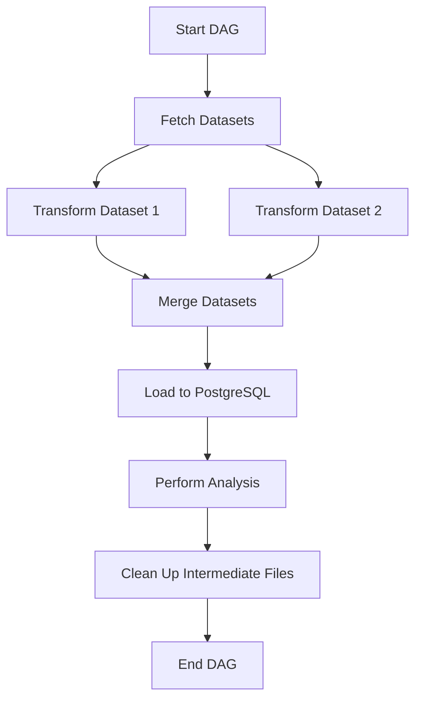
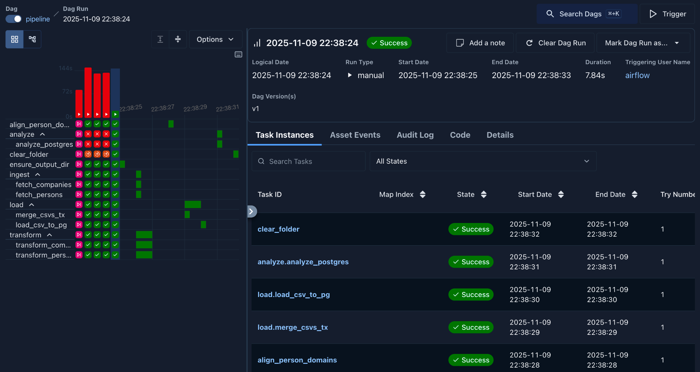
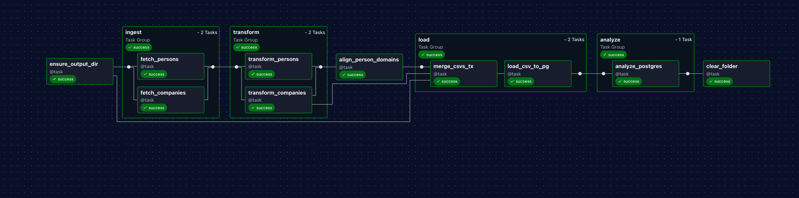

# 🌀 Airflow Data Engineering Pipeline

This repository contains an **Apache Airflow pipeline** designed to **ingest, transform, and analyze** multiple datasets in a containerized environment. The project demonstrates end-to-end **data pipeline orchestration**, **parallel processing**, and **database integration** using **PostgreSQL** — all deployed via **Docker** and managed through **Airflow DAGs**.

---

## 🚀 Project Overview

This pipeline automates the following workflow:

1. **Data Ingestion**  
   - Fetches two related datasets (CSV format).  
   - Datasets are stored locally within the container under `/opt/airflow/data`.

2. **Data Transformation**  
   - Cleans and standardizes columns (e.g., handling nulls, formatting strings, renaming columns).  
   - Aggregates and filters data for meaningful insights.  
   - TaskGroups are used to organize transformation steps logically.

3. **Data Loading (ETL)**  
   - Merges the transformed datasets.  
   - Loads the final result into a **PostgreSQL** database.  
   - Uses Airflow’s `PostgresHook` for database connectivity.

4. **Analysis / Output**  
   - Reads the cleaned data from PostgreSQL.  
   - Performs a simple analysis — for example, generating summary statistics or a visualization.  
   - Saves results to `/opt/airflow/output`.

5. **Cleanup**  
   - Deletes any intermediate CSVs or temporary files created during execution.

---

## ⚙️ Architecture Diagram



---

## 🧩 Tech Stack

- **Apache Airflow** – Orchestration
- **PostgreSQL** – Data storage
- **Docker + Dev Containers** – Reproducible environment
- **Python (Pandas, Faker, Psycopg2)** – Data transformation & analysis

---

## 🗂 Repository Structure

```
├── dags/
│   └── pipeline.py           # Main Airflow DAG
├── data/                     # Raw and transformed datasets
├── Dockerfile                # Container setup
├── devcontainer.json         # VS Code remote development config
├── requirements.txt          # Python dependencies
├── screenshots/              # DAG run + Graph view screenshots
├── README.md                 # Documentation (this file)
└── output/                   # Final results or visualization
```

---

## 🧰 Setup Instructions

### 1. Clone the repository
```bash
git clone https://github.com/arushi40868/Airflow_DE_Final.git
cd Airflow_DE_Final
```

### 2. Build and start the containers
```bash
docker-compose up --build
```

### 3. Access the Airflow UI
Visit **http://localhost:8080** and log in using:
```
Username: airflow
Password: airflow
```

### 4. Trigger the DAG
- Enable the DAG named `pipeline` in the Airflow UI.  
- Click **Trigger DAG** to run the workflow manually or wait for its scheduled run.

---

## 📊 Results & Analysis

Once the DAG completes:
- The final merged data table is stored in **PostgreSQL** under the target schema/table.
- The output folder contains analysis results such as:
  - Aggregated metrics  
  - Summary statistics  
  - Visualization (if generated)

---

## 📸 Screenshots

| DAG Status | Graph View |
|-------------|-------------|
|  |  |

---

## 🧼 Cleanup

After a successful run, temporary datasets are automatically deleted.  
If needed, you can manually clear all intermediate files with:
```bash
docker exec -it airflow-webserver rm -rf /opt/airflow/data/temp/
```

---

## 🧠 Key Learnings

- Building modular ETL workflows using **TaskGroups**
- Handling dependencies and retries in Airflow
- Loading data into relational databases with `PostgresHook`
- Containerizing Airflow pipelines for reproducibility
- Visualizing DAGs for process transparency

---

## 👩‍💻 Author

**Arushi Singh**  
Business Intelligence Engineer | Data Science Enthusiast  
📍 [GitHub](https://github.com/arushi40868) • [LinkedIn](https://www.linkedin.com/in/arushi-singh40868/)
